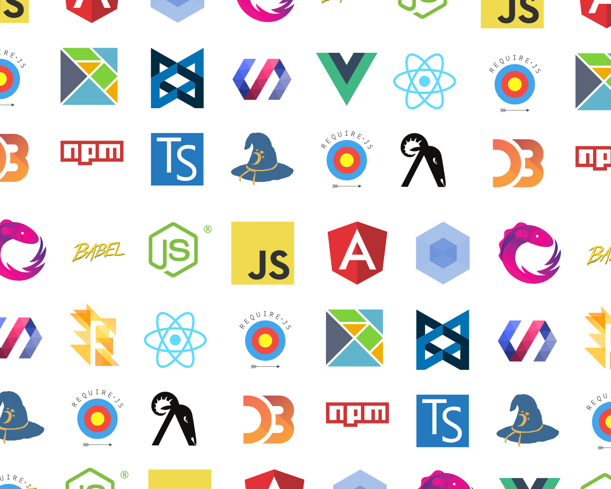

## Reasons for Using a UI Framework
The primary reason for using a UI framework is to save the time for development.
The frame work allows for the implementation of designs without writing the same code as the original. Unless you have to rewrite the exactly same code as someone else has already developed to implement a function. This advantage becomes particularly apparent when working on projects in a group.
For example, by leveraging a framework, developers can eliminate the need to create designs from scratch.
This allows developers to focus more on essential features, reducing both the time and cost of the project.
This not only saves time for the engineers who are in charge of the projects for the development but also results in cost savings on labor for the company.
Additionally, these UI frameworks, which offer a large amount of features or functions, provide a consistent design to customers. Therefore, from a user's perspective, it can be anticipated that web pages that are easy to understand and use will be created and delivered.

## Bootstrap for Web Design
When implementing web pages using HTML/CSS, Bootstrap 5 has proven to be exceptionally efficient and stylish in design.
For example, if I want to create a web page for another restaurant I own, based on an existing restaurant's webpage, I can easily find out what classes and designs (HTML, CSS, or JavaScript) the original page uses by utilizing the Inspection feature available in browsers like Google Chrome. Of course, simply copying it is not acceptable from privacy and copyright perspectives, as anyone could replicate it. However, by using Bootstrap, it is possible to create a webpage that is original yet similar to the key elements of the original. I was very surprised by this reproducibility, as most functionalities can be achieved with existing features.

## Django A Framework for Python

In the programming language Python, I frequently utilize a framework called Django. This framework allows the creation of Web APIs and web applications, user authentication, and site management pages. 
Also, used together with SQL, it facilitates database management and can enhance security by limiting access authorizations to database section with **minimum required level**. The term **minimum required level** is used here for a reason, as the security of APIs and web applications developed with Django is generally not considered to be very high securitied. 
However, this should not pose a major problem if the developer has a reasonable understanding on security.
Thus, while the framework itself can significantly save the programmer's time and assist in writing programs easily, there can be disadvantages such as the security aspects of Django. Therefore, when using a framework, it is crucial for programmers to be aware of the characteristics of the framework they are using and for what purpose, and to write code accordingly.
