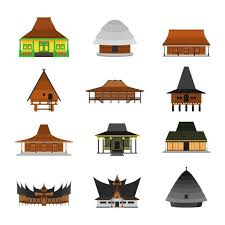
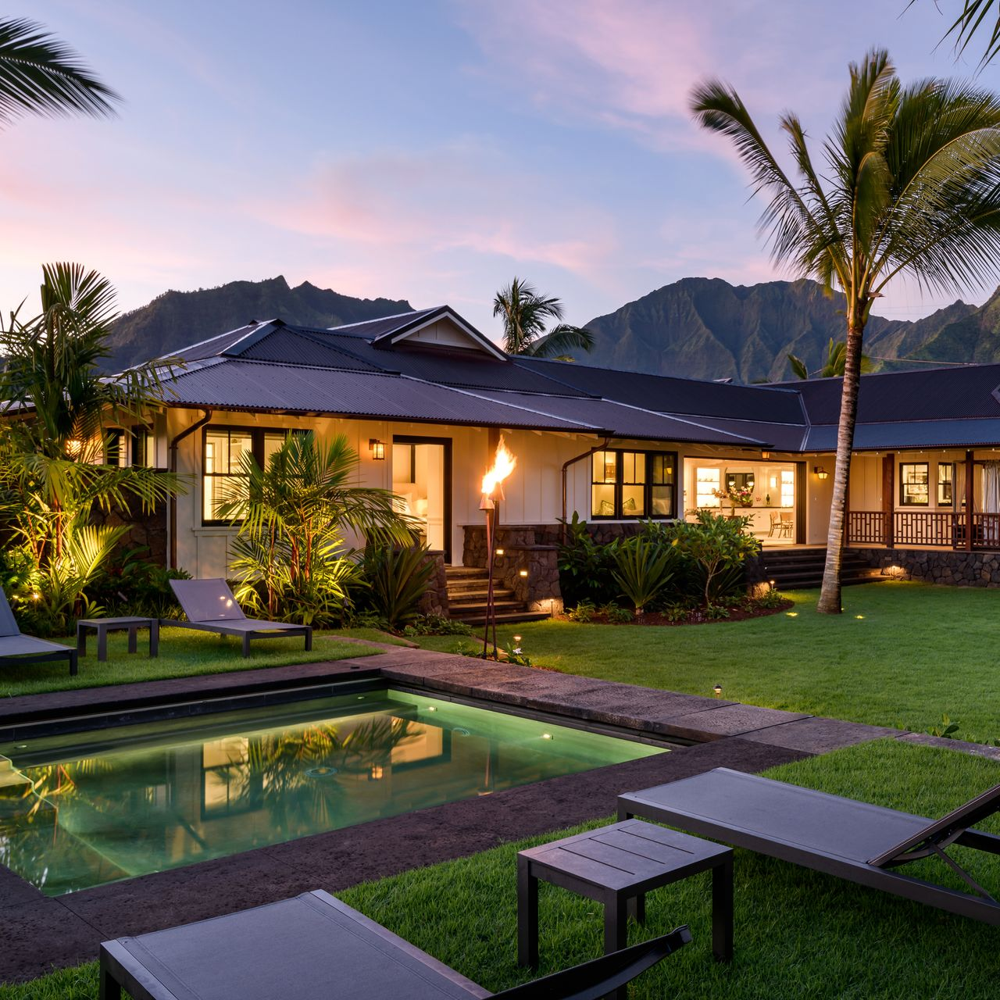

### Overview
- [Functional Aspects of Design Patterns](#functional-aspects-of-design-patterns)
- [Design Patterns in Object-Oriented Programming](#design-patterns-in-object-oriented-programming)


### Functional Aspects of Design Patterns
### Creational Patterns:
**Creational patterns** deal with object creation mechanisms. 

**Singleton:** Ensures a class has only one instance and provides a global point of access to it.

**Factory Method:** Defines an interface for creating an object, but lets subclasses decide which class to instantiate.

**Builder:** Separates the construction of a complex object from its representation, allowing the same construction process to create different representations.

### Structural Patterns:
**Structural patterns** are concerned with how classes and objects are composed to form larger structures. Examples include:

**Adapter:** Allows interfaces of incompatible objects to work together.

**Decorator:** Adds new functionality to an object dynamically.

**Facade:** Provides a simplified interface to a complex subsystem.

### Behavioral Patterns:
**Behavioral patterns** are concerned with algorithms and the assignment of responsibilities between objects.

**Observer:** Defines a dependency between objects so that when one object changes state, all its dependents are notified.

**Strategy:** Enables an algorithm's behavior to be selected at runtime.

**Command:** Encapsulates a command request as an object, thereby letting you parameterize clients with different requests.

### Design Patterns in Object-Oriented Programming
```
public class House {
    // Attributes of the house
    private String color;
    private int numberOfRooms;
    private double squareFootage;

    // Constructor to initialize the House object
    public House(String color, int numberOfRooms, double squareFootage, boolean hasGarage) {
        this.color = color;
        this.numberOfRooms = numberOfRooms;
        this.squareFootage = squareFootage;
    }

    // Getter and Setter methods
    public String getColor() {
        return color;
    }

    public void setColor(String color) {
        this.color = color;
    }

    public int getNumberOfRooms() {
        return numberOfRooms;
    }

    public void setNumberOfRooms(int numberOfRooms) {
        this.numberOfRooms = numberOfRooms;
    }

    public double getSquareFootage() {
        return squareFootage;
    }

    public void setSquareFootage(double squareFootage) {
        this.squareFootage = squareFootage;
    }

    // Method to display information about the house
    public void displayInfo() {
        System.out.println("House Details:");
        System.out.println("Color: " + color);
        System.out.println("Number of Rooms: " + numberOfRooms);
        System.out.println("Square Footage: " + squareFootage);
    }
```




#### Different House in Multiple Locations:
Using a class method to create the basic form of a house (in this example, all houses are assumed to have at least one roof and room in addition to its color), I set the minimum components of a house such as color, roof, rooms, and square of house. Additionally, corresponding getter() and setter() functions are provided as public functions in the class.

Using this class makes possible to design houses with various additional features besides the basic components of a house. For instance, let's consider designing a house for an area with heavy snow. One idea could be having a design of a house whose roof has an effective slope to remove accumulated snow every night. Another possible house could also be equipped with heating and a parking lot or garage. On the other hand, let's imagine designing a house in Hawaii, in addition to the essential structures like roofs and room, features like windows that offer good ventilation and airflow, and the installation of air conditioning can be preferable. These additional features are independent of the basic model of the house I set up with class definition which has color, roof, rooms, and space capacity, but they are essential.
