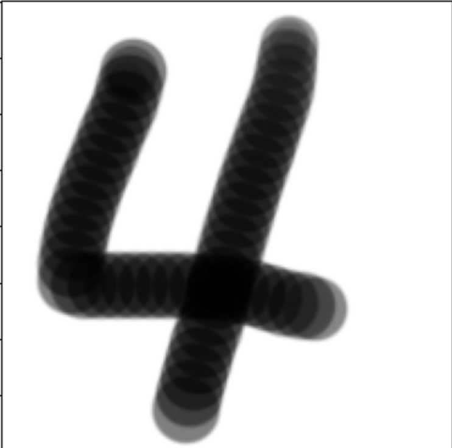

  
  

## About the project
In this project, I utilized a sample dataset of handwritten digits to extract features of each number using Convolutional Neural Networks (CNN). The extracted features, represented as vectors, were then employed to create a training dataset. This dataset was essential for training the model to recognize and interpret handwritten digits. Following the model training phase, I conducted a test using a set of handwritten digit images that I personally created. These images were uploaded to the system as test data. The trained model was then applied to these images to evaluate its effectiveness in accurately identifying and classifying the handwritten digits. This process allowed me to assess the model's precision and reliability in interpreting real-world handwritten data. The goal was to determine how well the CNN model, trained on a standardized dataset, could generalize its learning to new, unseen examples of handwritten digits, particularly those created by myself, thereby testing the robustness and adaptability of the model.

## Code reference
```
import pandas as pd
import numpy as np
from sklearn.datasets import load_digits
import matplotlib.pyplot as plt
from sklearn.model_selection import train_test_split
from sklearn import svm
from sklearn.metrics import accuracy_score
from PIL import Image

digits = load_digits()
df = pd.DataFrame(digits.data)
```

```
X = digits.data
y = digits.target
X_train, X_test, y_train, y_test = train_test_split(X, y, random_state=0)

model = svm.SVC(kernel="rbf", gamma=0.001)
model.fit(X_train, y_train)

pred = model.predict(X_test)
score = accuracy_score(y_test, pred)
print("Accuracy:", score*100, "%")
```

```
image = Image.open("4.png").convert("L")
plt.imshow(image, cmap="gray")
plt.show()

image = image.resize((8, 8), Image.ANTIALIAS)
plt.imshow(image, cmap="gray")
plt.show()
```

```
# normalization
img = np.asarray(image, dtype=float)
img = 16 - np.floor(17*img/256)
img = img.flatten()
```

```
from sklearn.datasets import load_digits
from sklearn import decomposition
from mpl_toolkits.mplot3d import Axes3D

digits = load_digits()
X = digits.data
y = digits.target

# assign color 0~9
numbercolor = ["BLACK","BROWN","RED","DARKORANGE","GOLD",
               "GREEN","BLUE","PURPLE","GRAY","SKYBLUE"]

colors = []
for i in y:
	colors.append(numbercolor[i])


pca = decomposition.PCA(n_components=3)
features3 = pca.fit_transform(X)


df = pd.DataFrame(features3)


fig = plt.figure(figsize=(12, 12)) 
ax = fig.add_subplot(projection='3d')

ax.scatter(df[0], df[1], df[2], color=colors)


ty = 0
for col in numbercolor:
    ax.text(50, 30, 30-ty*5, str(ty), size=20, color=col)
    ty+=1
plt.show()
```

## What I learned in the project
The giggest takeaway from the project is that I could use my knowledge to Machine Learning to practice it.
Until I have done the project, I only knew the concept and some facts on machine learning or AI.

However, the actual coding let me think how the cocept works behind the code.
Through this experience, I was able to gain knowledge about the construction of simple models, ways to utilize sample datasets, and widely used models in machine learning.
