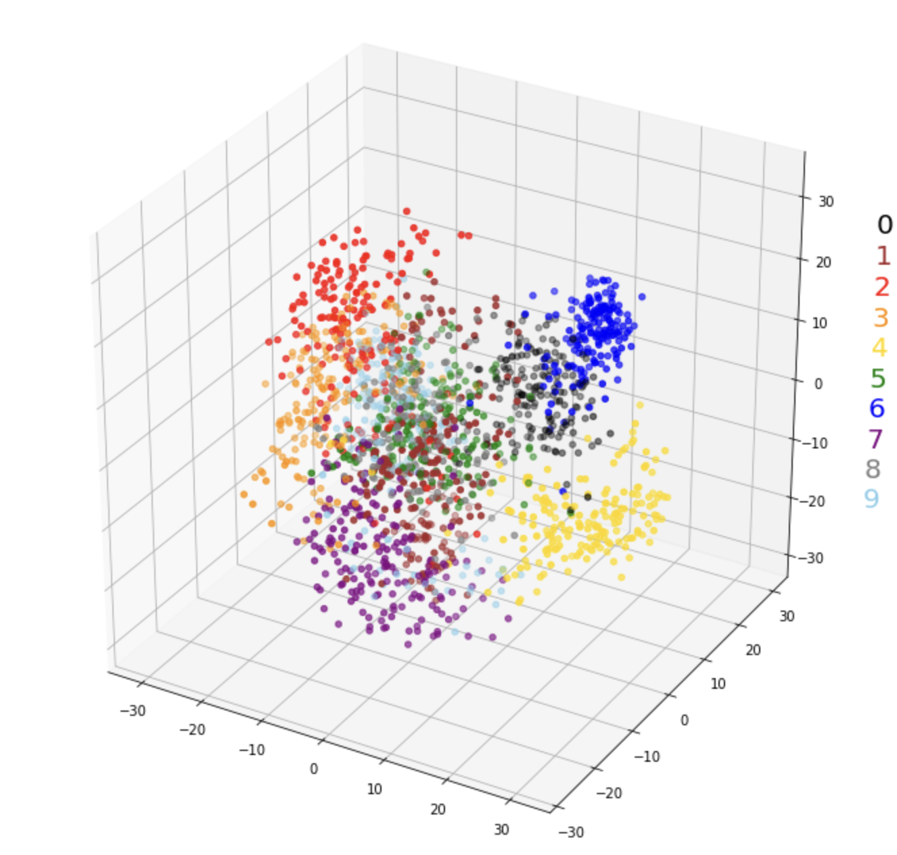

  
  

## About the project
In this project, I utilized a sample dataset of handwritten digits to extract features of each number using Convolutional Neural Networks (CNN). The extracted features, represented as vectors, were then employed to create a training dataset. This dataset was essential for training the model to recognize and interpret handwritten digits. Following the model training phase, I conducted a test using a set of handwritten digit images that I personally created. These images were uploaded to the system as test data. The trained model was then applied to these images to evaluate its effectiveness in accurately identifying and classifying the handwritten digits. This process allowed me to assess the model's precision and reliability in interpreting real-world handwritten data. The goal was to determine how well the CNN model, trained on a standardized dataset, could generalize its learning to new, unseen examples of handwritten digits, particularly those created by myself, thereby testing the robustness and adaptability of the model.
