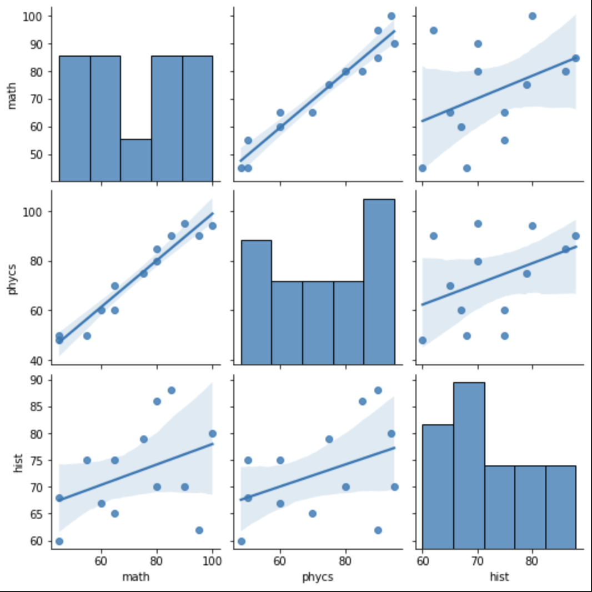

## About the project
"In this project, I compared the test results of each student by subject according to a fictional dataset and created a linear regression graph to show whether there are any correlational relationships in the test scores."

## Result & Takeaways
"The results did not show a correlation between students who are good at history also being good at mathematics or physics, as indicated by the low numerical value representing the correlation. However, it was observed that students who are proficient in mathematics also tend to score high in physics, and similarly, those who are skilled in physics tend to achieve high test scores in mathematics."
