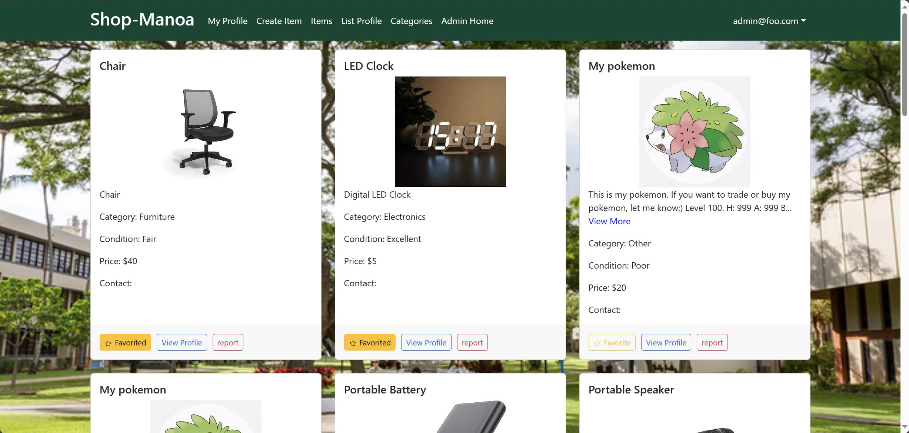
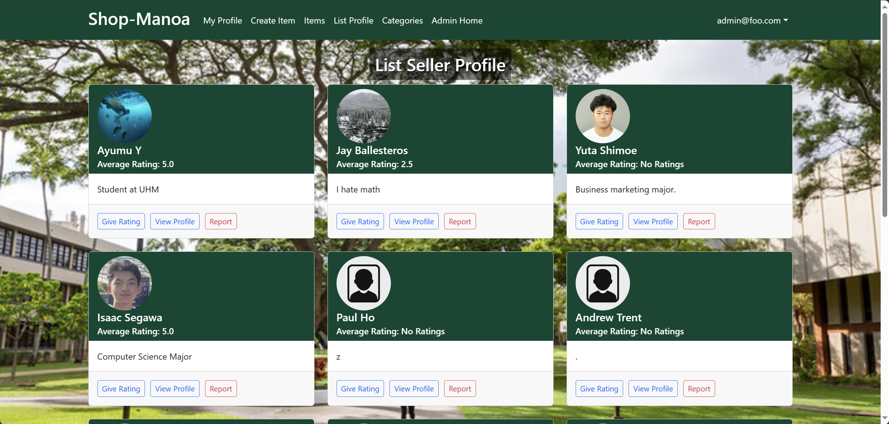

### Overview
 - [About Project](#about-project)
 - [Items List](#items-list)
 - [Sellers List](#sellers-list)
 - [My Role in Project](#my-role-in-project)
 - [Takeaways](#takeaways)

### About Project
We made a website for flea market for the members of UH Manoa. This website is a platform where students and faculty members of UHM can sell and buy products such as furniture and services each other. To sign up, you need an email address ending with **@hawaii.ed**u. Which also indicates that you are at UH. We used Meteor and React to build this website.

### Items List

Explore our vibrant Marketplace on Shop-Manoa. Our items listing page displays a diverse range of products from furniture to electronics, each listed with a photo, category, condition, and price. For instance, there is a 'Chair' under the Furniture category listed at $40 and a 'Digital LED Clock' in Electronics priced at $5. Each listing provides an option to view more details, contact the seller, or report any issues. Dive into our marketplace to find great deals and unique items like a collectible Pokémon, we are open for a various purpose! Not only a physical stuff, you can also sell your service such as cleaning room instead of owner, however, all items listed on the page should be related to UH students or faculties members!

### Sellers List

Welcome to the Shop-Manoa Seller Profiles page. Here, users can browse through profiles of fellow students and local sellers. Each profile features a user photo, their average rating, and a brief personal description. For example, Ayumu Y. is a student at UHM with a perfect 5.0 rating, indicating his reliability. Users can interact by giving ratings, viewing detailed profiles, or reporting any concerns. This community-driven platform enables safe and trustworthy transactions among members. Also, in each profile, users can see the items that the seller is selling and have a reporting button to report any inappropriate users.

### My Role in Project
I was in charge of making reporting system for the website. It allows you to report any inappropriate users and items with some categories. This system is important to keep the website safe and reliable. I also made a connections between the report function with the items and the sellers pages. From the administration side, we can see who reported and what they reported. This system makes easier for us to detect any inappropriate users and items.

### Takeaways
One of the biggest takeaways from this project was learning how to work with a team. I had to communicate with my team members to make sure we were all on the same page. I also learned how to work with a new technology, Meteor. I had never used Meteor before, so I had to learn how to use it. Fortunately, there was a template made by ICS department at UHM. I was able to use that template to help me get started. I also learned how to use React. I had used React before, but I had never used it in a project this big. I learned how to use React to make the website more interactive. Besides that, I recognized how useful the React is! Overall, I learned a lot from this project, I am proud of what we were able to accomplish.
