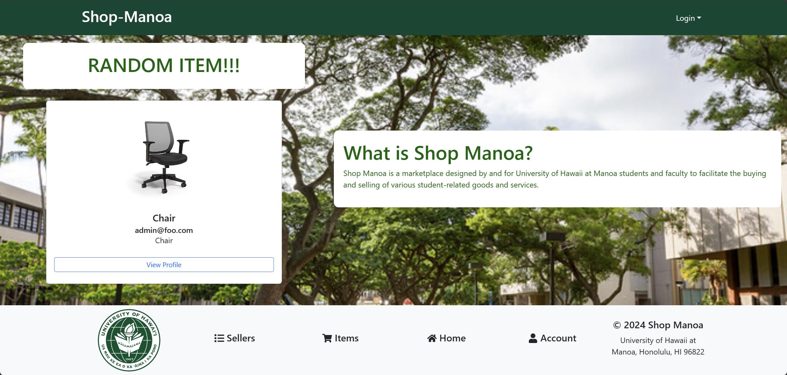

### Welcome to Shop Manoa!!
We provide a platform where students and faculty members of UHM　can sell and buy products such as furniture and services each other. To sign up, you need an email address ending with **@hawaii.ed**u. Which also indicates that you are at UH.

### Items List

Explore our vibrant Marketplace on Shop-Manoa. Our items listing page displays a diverse range of products from furniture to electronics, each listed with a photo, category, condition, and price. For instance, there is a 'Chair' under the Furniture category listed at $40 and a 'Digital LED Clock' in Electronics priced at $5. Each listing provides an option to view more details, contact the seller, or report any issues. Dive into our marketplace to find great deals and unique items like a collectible Pokémon, we are open for a various purpose! Not only a physical stuff, you can also sell your service such as cleaning room instead of owner, however, all items listed on the page should be related to UH students or faculties members!

### Sellers List

Welcome to the Shop-Manoa Seller Profiles page. Here, users can browse through profiles of fellow students and local sellers. Each profile features a user photo, their average rating, and a brief personal description. For example, Ayumu Y. is a student at UHM with a perfect 5.0 rating, indicating his reliability. Users can interact by giving ratings, viewing detailed profiles, or reporting any concerns. This community-driven platform enables safe and trustworthy transactions among members. Also, in each profile, users can see the items that the seller is selling and have a reporting button to report any inappropriate users.

### Links
<a href="https://shop-manoa.github.io//">More info? Click here!</a>

<a href="https://shop-manoa.com//"> Shop Manoa Now!</a>
